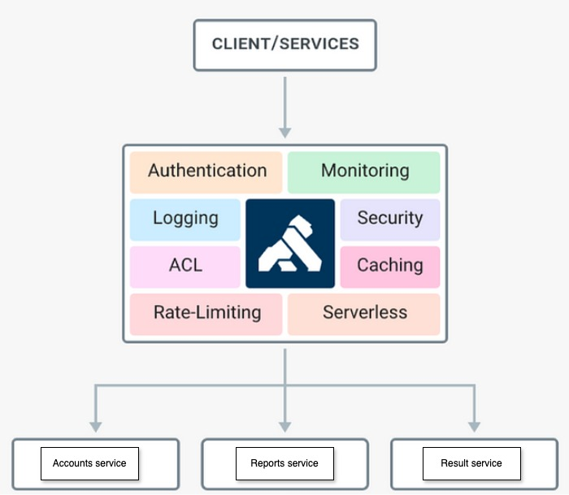

# Kong API Gateway Demo

This demo project demonstrates the usage of Kong API Gateway with multiple microservices.
## The project contains six services:
 
- Postgres (Kong): Database used by Kong in DB mode.
- Kong: API Gateway managing requests to the microservices.
- Reports Service: FastAPI-based microservice for reporting.
- Results Service: FastAPI-based microservice for results and requires auth
- Accounts Service: Django-based microservice for user registration and JWT management.
- Postgres (Accounts): Database used by the Accounts service

## Architecture




## Prerequisites
* Docker
* Docker Compose
* Kong Deck CLI

### Install Deck
```bash
brew tap kong/deck
brew install deck
```


## Project Structure
* config/: Kong configuration files.
* reports/: FastAPI-based report microservice.
* results/: FastAPI-based result microservice.
* accounts_service/: Django-based accounts service.


### Docker Setup
Each project contains its own Dockerfile for building the respective service containers. The project also contains a Docker Compose file for orchestrating the services.

## Usage
To use this demo, follow these steps:

Start Kong in DB mode with PostgreSQL:
```bash
make kong-postgres
```

Import the configurations:
```bash
make kong-import
```

